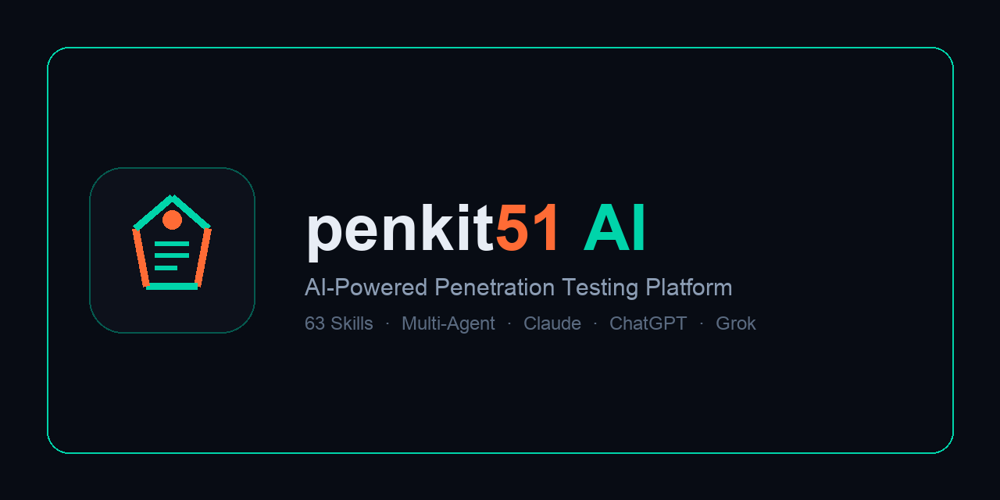
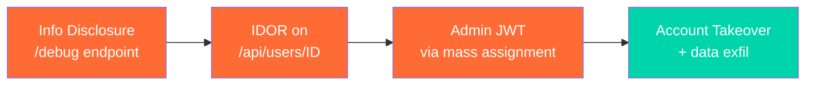
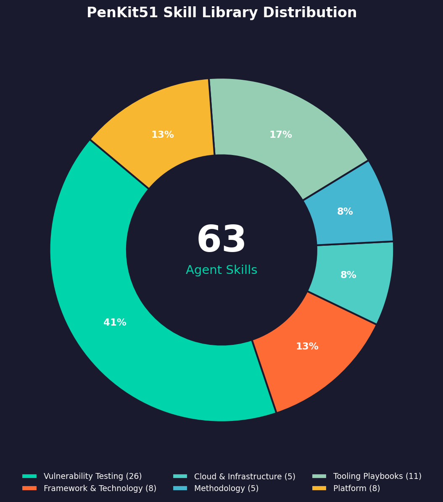
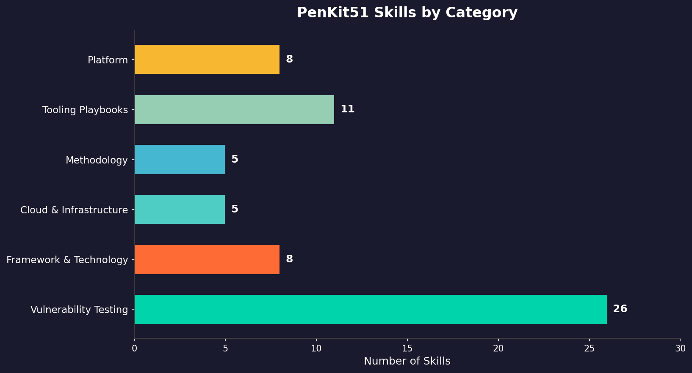
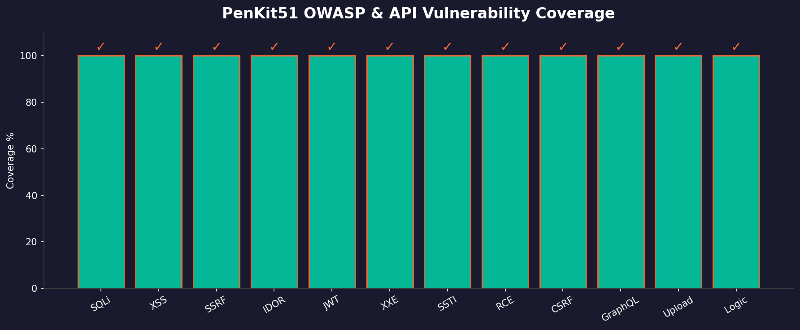
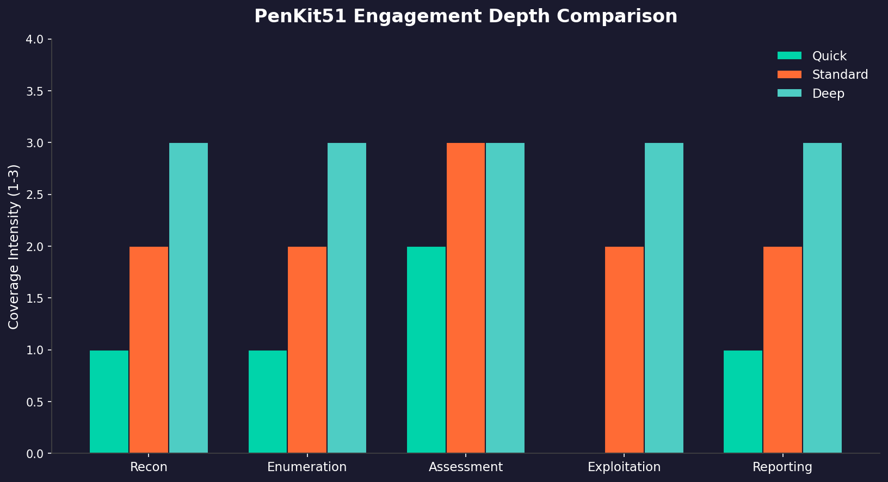
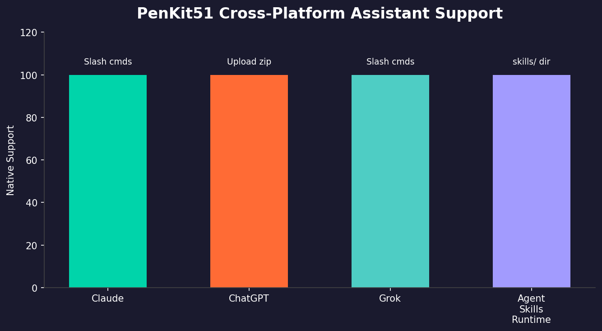
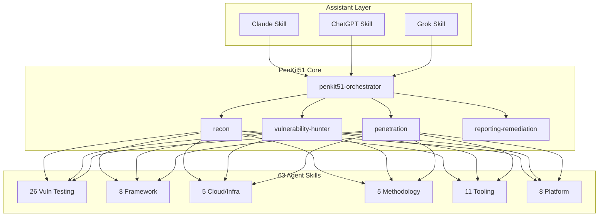

<div align="center">



<p><strong>The open-source AI penetration testing platform with 63 deep exploitation skills, multi-agent orchestration, and cross-platform assistant support.</strong></p>

[](LICENSE)
[](skills/)
[](agents/)
[](assistant-skills/)
[](assets/)

[About](#about) · [Features](#features) · [Examples](#examples) · [Charts](#project-analytics) · [Quick Start](#quick-start) · [Skill Library](#skill-library) · [Architecture](#architecture) · [Disclaimer](#disclaimer)

</div>

---

## About

**PenKit51** is a production-ready AI penetration testing framework built for security researchers, bug bounty hunters, red teams, and DevSecOps engineers who need **evidence-backed findings** — not scanner noise.

Unlike generic security chatbots, PenKit51 ships **63 specialized Agent Skills** — each a deep exploitation playbook with attack surface mapping, WAF bypass techniques, validation steps, and remediation guidance. A multi-agent orchestrator delegates recon, enumeration, exploitation, and reporting to specialist sub-agents while enforcing PoC-first evidence standards.

### What makes PenKit51 different?

| Capability | PenKit51 | Typical AI security tools |
|------------|----------|---------------------------|
| **Skill depth** | 63 vuln-class playbooks (avg. 15KB each) | Generic prompts or shallow checklists |
| **Evidence standard** | Mandatory PoC + HTTP evidence + CVSS | Theoretical findings without proof |
| **Multi-agent** | Orchestrator + 5 specialist agents | Single-threaded Q&A |
| **Platform support** | Native skills for Claude, ChatGPT, Grok | Single-platform lock-in |
| **Vuln chaining** | Builds multi-step attack paths | Isolated single-vuln reports |
| **Engagement modes** | Quick / Standard / Deep with defined ROE | One-size-fits-all scanning |

### Who is this for?

| Audience | Use Case |
|----------|----------|
| **Penetration testers** | Authorized web/API/cloud assessments with structured methodology |
| **Bug bounty hunters** | Focused vuln-class testing with bypass techniques and validation |
| **Security engineers** | DevSecOps integration, CI/CD security reviews, SAST+DAST workflows |
| **Red teams** | Multi-phase engagements with orchestrated specialist agents |
| **AI assistant users** | Drop-in skills for Claude, ChatGPT, or Grok — no platform lock-in |

---

## Features

### Deep Skill Library (63 packs)

Progressive-disclosure skill packs following the [Agent Skills](https://agentskills.io) open standard. Each skill includes attack surface mapping, exploitation techniques, WAF bypass methods, validation steps, and remediation guidance.

### Multi-Agent Orchestration

| Agent | Role |
|-------|------|
| `penkit51-orchestrator` | Master coordinator — plans, delegates, chains findings |
| `vulnerability-hunter` | Deep single-class vuln discovery with PoC validation |
| `recon` | Asset discovery and attack surface mapping |
| `penetration` | Exploitation and impact proof |
| `reporting-remediation` | Professional findings report |

### Assistant Skills (Claude · ChatGPT · Grok)

Platform-native skill packs with slash commands, vulnerability matrix, and report templates:

```
/penkit51-ai plan https://target.com
/penkit51-ai deep https://target.com
/penkit51-ai test https://api.target.com sqli
/penkit51-ai report
```

### Testing Methodology

Three engagement depths:

- **Quick** — CI/CD, PR diff-scoped, time-boxed reviews (~30 min)
- **Standard** — balanced web application assessment (~4–8 hours)
- **Deep** — exhaustive coverage with vulnerability chaining (multi-day)

### Evidence Standards

Every confirmed finding requires:

1. Reproducible PoC with exact steps
2. HTTP request/response evidence
3. Impact statement (attacker outcome)
4. CVSS-based severity reasoning
5. Specific remediation guidance

---

## Examples

### Example 1 — Start a deep engagement (Grok / Claude)

```
/penkit51-ai deep https://staging.target.com

Scope: staging.target.com and *.staging.target.com
Exclude: payment gateway, production database, third-party CDN
Authorization: confirmed — client SOW signed 2026-07-01
ROE: no DoS, no data destruction, no social engineering
```

**What happens:**

1. Orchestrator loads `engagement-planning` + `deep-pentest-methodology`
2. Spawns `recon` agent → subfinder, httpx, nmap against scope
3. Spawns `enumeration` agent → katana crawl, ffuf dir brute, nuclei scan
4. Parallel vuln-class agents load matching skills (SQLi, XSS, IDOR, SSRF…)
5. Confirmed findings recorded with PoC evidence
6. `reporting-remediation` agent delivers structured report

---

### Example 2 — Focused SQL injection test

```
/penkit51-ai test https://api.target.com/v1/users?id=1 sqli
```

The assistant loads `sql-injection-testing` and tests systematically:

```http
GET /v1/users?id=1' HTTP/1.1
Host: api.target.com

# Error-based signal → version fingerprint
GET /v1/users?id=1 AND extractvalue(1,concat(0x7e,version()))-- - HTTP/1.1

# Boolean blind confirmation
GET /v1/users?id=1 AND 1=1 HTTP/1.1   → 200, 1,247 bytes
GET /v1/users?id=1 AND 1=2 HTTP/1.1   → 200, 892 bytes  ← differential
```

**Deliverable format:**

| Field | Value |
|-------|-------|
| **Vulnerability** | SQL Injection (boolean blind) |
| **Parameter** | `id` (GET) |
| **Severity** | High (CVSS 8.6) |
| **Impact** | Full database read access via blind extraction |
| **PoC** | Differential response on `AND 1=1` vs `AND 1=2` |
| **Remediation** | Parameterized queries; disable error verbosity |

---

### Example 3 — Vulnerability chaining

PenKit51 doesn't stop at isolated findings. The orchestrator chains low-severity issues into high-impact paths:



**Chain narrative:**

1. `/debug` leaks internal user IDs → `information-disclosure-testing`
2. `/api/users/{id}` lacks ownership check → `idor-testing`
3. `PATCH /api/users/me` accepts `role: admin` → `mass-assignment-testing`
4. Forged admin JWT → full account takeover

---

### Example 4 — CI/CD quick scan on a PR diff

```
/penkit51-ai scan https://pr-142.preview.target.com

Mode: quick
Focus: changed endpoints only (/api/v2/checkout, /api/v2/coupons)
Authorization: internal staging — approved
```

Quick mode limits scope to changed attack surface — ideal for pull request security gates in DevSecOps pipelines.

---

### Example 5 — Install assistant skill locally

```bash
# Clone PenKit51
git clone https://github.com/xAmirHamza77/PenKit51.git
cd PenKit51

# Install for Claude Code
cp -R assistant-skills/claude/penkit51-ai ~/.claude/skills/

# Install for Grok / Cursor
cp -R assistant-skills/grok/penkit51-ai ~/.grok/skills/

# Package ChatGPT upload zip
./scripts/package-assistant-skills.sh
# → Upload dist/penkit51-ai-chatgpt.zip at chatgpt.com/skills
```

---

## Project Analytics

### Skill Library Distribution



### Skills by Category



| Category | Skills | Examples |
|----------|--------|----------|
| **Vulnerability Testing** | 26 | SQLi, XSS, SSRF, IDOR, JWT, XXE, SSTI, CSRF |
| **Framework & Technology** | 8 | FastAPI, Next.js, Django, NestJS, GraphQL, OAuth |
| **Cloud & Infrastructure** | 5 | AWS Audit, Kubernetes, Containers, Network Pentest |
| **Methodology** | 5 | Deep/Standard/Quick modes, Planning, Orchestration |
| **Tooling Playbooks** | 11 | nmap, nuclei, httpx, ffuf, sqlmap, katana, semgrep |
| **Platform** | 8 | API Security, Code Review, Mobile, SAST, Automation |

### Vulnerability Coverage



### Engagement Depth Comparison



### Cross-Platform Support



---

## Quick Start

### Assistant Skills

| Platform | Install |
|----------|---------|
| **Claude** | `cp -R assistant-skills/claude/penkit51-ai ~/.claude/skills/` |
| **ChatGPT** | Upload `dist/penkit51-ai-chatgpt.zip` at [chatgpt.com/skills](https://chatgpt.com/skills) |
| **Grok** | `cp -R assistant-skills/grok/penkit51-ai ~/.grok/skills/` |

```bash
# Package upload zips
./scripts/package-assistant-skills.sh

# Install Claude + Grok locally
./scripts/install-assistant-skills.sh all
```

### Start an Engagement

```
/penkit51-ai deep https://target.com

Scope: all subdomains of target.com
Exclude: payment gateway, production database
Authorization: confirmed — client SOW signed
```

### Use Skill Packs Directly

Point any Agent Skills-compatible runtime at the `skills/` directory. The model loads methodology on demand via progressive disclosure.

### Optional Platform Deployment

```bash
PLATFORM_DIR=/path/to/platform ./scripts/install.sh
```

---

## Skill Library

### Vulnerability Testing (26)

SQLi · XSS · SSRF · CSRF · XXE · IDOR · RCE · SSTI · NoSQLi · Deserialization · File Upload · JWT · Race Conditions · HTTP Smuggling · Prototype Pollution · Mass Assignment · Open Redirect · Header Injection · Path Traversal · Subdomain Takeover · Business Logic · BFLA · Info Disclosure · LLM Prompt Injection · LDAP · XPath

### Framework & Technology (8)

FastAPI · Next.js · Django · NestJS · Supabase · Firebase/Firestore · GraphQL · OAuth

### Cloud & Infrastructure (5)

AWS Audit · Kubernetes · Container Security · Network Penetration · Cloud Security Audit

### Methodology (5)

Deep · Standard · Quick pentest modes · Engagement Planning · Orchestration

### Tooling Playbooks (11)

nmap · nuclei · httpx · ffuf · subfinder · naabu · katana · sqlmap · semgrep · Browser Exploitation · Python Exploit Runtime

### Platform (8)

API Security · Code Review · Mobile App · Vulnerability Assessment · Security Automation · Incident Response · Whitebox/SAST · Source-Aware Testing

---

## Architecture



```
PenKit51/
├── assets/
│   ├── logo.png                      # App icon (512×512)
│   ├── logo-icon.svg                 # Transparent vector icon
│   ├── github-banner.png             # README hero banner
│   ├── social-preview.png            # Social / repo preview card
│   ├── chart-skill-distribution.png  # Skill library donut chart
│   ├── chart-skills-by-category.png  # Category bar chart
│   ├── chart-vuln-coverage.png       # OWASP coverage chart
│   ├── chart-engagement-depth.png    # Quick/Standard/Deep comparison
│   └── chart-platform-support.png    # Cross-platform support chart
├── skills/                           # 63 Agent Skills (SKILL.md)
├── agents/
│   ├── orchestrator.md               # Master coordinator
│   └── vulnerability-hunter.md       # Deep vuln specialist
├── roles/
│   └── penkit51-ai.yaml              # Pre-configured pentest role
├── assistant-skills/
│   ├── claude/penkit51-ai/           # Claude Code skill
│   ├── chatgpt/penkit51-ai/          # ChatGPT upload skill
│   └── grok/penkit51-ai/             # Grok/Cursor skill
├── dist/                             # Packaged upload zips
└── scripts/
    ├── merge_skills.py
    ├── package-assistant-skills.sh
    └── install-assistant-skills.sh
```

---

## Regenerating Skills

```bash
./scripts/prepare_upstream.sh
python3 scripts/merge_skills.py
python3 scripts/sanitize_names.py
```

---

## Disclaimer

**Authorized testing only.** Use PenKit51 exclusively on systems you own or have explicit written permission to test. You are solely responsible for ethical and legal compliance. The authors assume no liability for misuse.

---

<div align="center">


<br>

**PenKit<span style="color:#ff6b35">51</span>** — Forge vulnerabilities into validated findings.

</div>